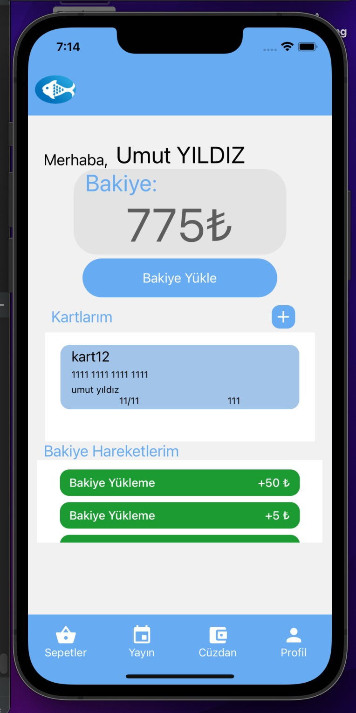

# IZTECH 'Things'

This repository is where I keep the projects, assignments, and more from my university life. I can say that I’ve ventured into a wide range of fields, and you’ll understand this as you browse through the repository.

The repository doesn’t cover my entire university life, mainly because the school transitioned to a different educational system after a certain point. Unfortunately, many of the assignments and projects were deleted. So, we’ll make do with what we have.

The projects below may not be included in these files. Only images are available, but I’ll try to explain what we did in general.

## PANDANCE 
This is my favorite project among the ones I was involved in. In this project, we combined machine learning and web systems to create a fun dance project. The core approach of the project was to analyze the poses of people in the videos within the system and then compare the user's dance performance with the one recorded in the system. By looking at the joint points and movements, we came up with a fun and highly energetic project.

Here’s an overview:

There are many individual dance videos inside.
By looking at the differences between limbs and joint points, you get a similarity value.
Both practice and challenge modes are available.
You compete with others based on how long the similarity value can be maintained.
Performance was kept light for the day’s conditions, and endpoints like hand and foot joints were not included.
You can check the photos from this link:
[Photos](https://github.com/hazimalperata/IZTECH/tree/main/photos/pandance)

#### Similarity Calculation

#### Webcam and Video Pose Estimation

#### First Pose Estimation Test

## Balıklıova Auction Application

This application, developed with React Native, has been a project where we documented the basic business requirements. It’s a project where we acted according to the requirements and shaped it with feedback over time. This app is one of my first mobile applications. Developed by two people, this application was extremely helpful in understanding the basic requirements of the projects I’ve developed. It is based on live streaming support, allowing vendors to broadcast video in real time and give prices instantly.

You can check the photos from this link:
[Photos](https://github.com/hazimalperata/IZTECH/tree/main/photos/balikliova)

## 8051 Microprocessor Projects

I started with the elective course on microprocessor families and developed projects. Before that, I had a curiosity about Arduino. Actually, hardware is just as interesting to me as software. Maybe one day I’ll return to it, who knows :)

### Thermometer - Temperature Sensor

### 4-Bit 4-Operation Calculator

